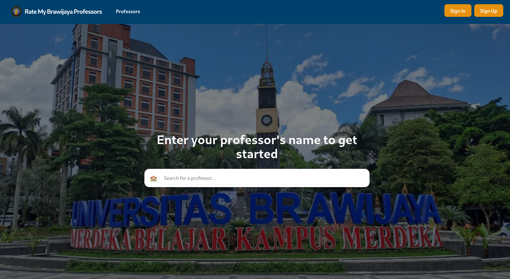

# RateMyUBProf

RateMyUBProf is a web application designed to help students rate and review professors at their university precisely Brawijaya University so other students could prepare the best for their upcomming class professor.

This is a [Next.js v15](https://nextjs.org) project bootstrapped with [`create-next-app`](https://nextjs.org/docs/app/api-reference/cli/create-next-app).

For backend repository, you can it right in [this github repository](https://github.com/devanfer02/ratemyubprof-client)

## Getting Started

First, run the development server:

```bash
npm run dev
# or
yarn dev
# or
pnpm dev
# or
bun dev
```

Open [http://localhost:3000](http://localhost:3000) with your browser to see the result.

You can start editing the page by modifying `app/page.tsx`. The page auto-updates as you edit the file.

This project uses [`next/font`](https://nextjs.org/docs/app/building-your-application/optimizing/fonts) to automatically optimize and load [Geist](https://vercel.com/font), a new font family for Vercel.

## Learn More

To learn more about Next.js, take a look at the following resources:

- [Next.js Documentation](https://nextjs.org/docs) - learn about Next.js features and API.
- [Learn Next.js](https://nextjs.org/learn) - an interactive Next.js tutorial.

You can check out [the Next.js GitHub repository](https://github.com/vercel/next.js) - your feedback and contributions are welcome!

## Deploy on Vercel

The easiest way to deploy your Next.js app is to use the [Vercel Platform](https://vercel.com/new?utm_medium=default-template&filter=next.js&utm_source=create-next-app&utm_campaign=create-next-app-readme) from the creators of Next.js.

Check out our [Next.js deployment documentation](https://nextjs.org/docs/app/building-your-application/deploying) for more details.

## Other Stacks

| Tech              | Description                                                                 |
|-------------------|-----------------------------------------------------------------------------|
| [ShadCN UI](https://ui.shadcn.com)         | Accessible, customizable UI components built with Tailwind and Radix UI.        |
| [React Hook Form](https://react-hook-form.com) | Performant form validation with minimal re-renders and easy integration.        |
| [Next Auth](https://next-auth.js.org/) | Complete open-source authentication solution for Next.js applications. 